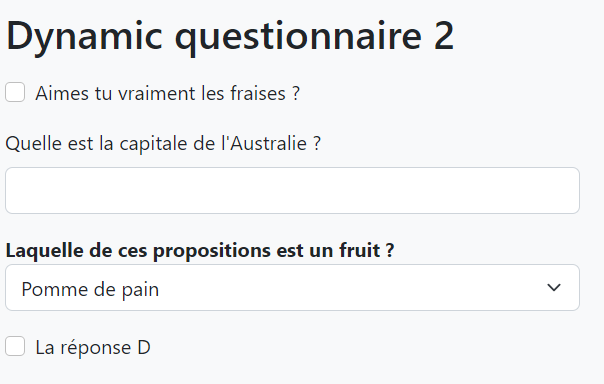

# Kata Questionnaire dynamique

## Sujet
L'objectif est de générer un questionnaire dynamique, paramétrable depuis une source de donnée.
* Chaque question est associée à un type de question, à savoir :
    * Checkbox
    * Input text
    * Select list

* Pour simplifier l'exercice, les données peuvent être stockées dans un fichier JSON / XML / SqlLite, mais la structure du code doit permettre de changer de mode de stockage facilement.

## Stack technique
* C#

Vous êtes également libre de choisir l'architecture que vous souhaitez mettre en place, l'idée est de voir comment vous développer.

## Projets template

Le projet présent dans la solution est ici pour vous aider si besoin, __mais n'est absolument pas obligatoire !__ Vous pouvez partir sur la structure que vous souhaitez.

## Visuel d'exemple
Voici un visuel pour vous donner une idée du résultat attendu (à titre informatif, il ne s'agit pas de le reproduire à l'identique)

| localhost:5000/questionnaire/1                    | localhost:5000/questionnaire/2                    |
| --------------------------------------------------| ------------------------------------------------- |
|   |   |

## Conception technique
 - Conception :
 (./images/conception.png)

 - Model physique de données : 
 (./images/mpd.png)

- Pattern d'architecture : 
 (./images/Pattern.png)
 
 - Injection de dépendance : 
   On peut changer la source de données entre SQLite et JSON.
 (./images/Injection.png)